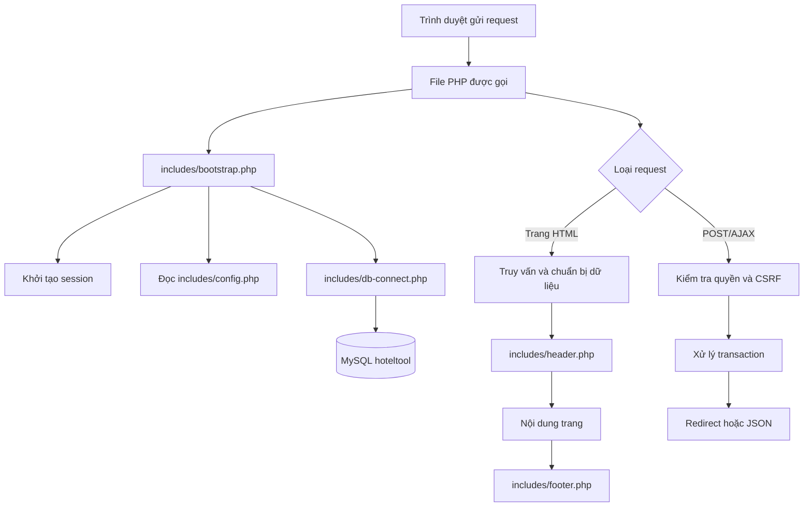

# Tài liệu kiến trúc và nhiệm vụ từng file của JoyTix

Tài liệu này mô tả cấu trúc hiện tại của dự án `hoteltool`, nhiệm vụ của từng file mã nguồn, các thành phần chính bên trong file, dữ liệu vào/ra, quan hệ giữa các file và những điểm cần lưu ý khi bảo trì.

## 1. Tổng quan hệ thống

JoyTix là website PHP thuần sử dụng MySQL, HTML, CSS và JavaScript. Website có bốn nhóm chức năng chính:

1. Khách truy cập xem, tìm kiếm, xem chi tiết và so sánh khách sạn.
2. Người dùng đăng ký, đăng nhập, xem lịch sử so sánh và tham gia cộng đồng.
3. Quản trị viên thêm, sửa, xóa khách sạn và tự động lấy thông tin từ dịch vụ bản đồ.
4. Các endpoint AJAX xử lý thích bài, xóa bài và lấy thông tin bản đồ mà không tải lại toàn bộ trang.

Luồng chung của gần như mọi request PHP:



## 2. Cấu trúc thư mục

```text
hoteltool/
├── includes/                 Thành phần nền tảng và layout dùng chung
├── css/                      CSS dùng chung
├── js/                       JavaScript dùng chung
├── images/                   Ảnh tĩnh thuộc giao diện
├── uploads/                  Ảnh khách sạn và bài cộng đồng được tải lên
├── migrations/               Script nâng cấp database cũ
├── index.php                 Trang chủ động
├── search.php                Trang kết quả tìm kiếm
├── detail.php                Trang chi tiết khách sạn
├── compare.php               Trang so sánh
├── community.php             Trang cộng đồng
├── profile.php               Trang tài khoản
├── admin*.php                Nhóm trang quản trị
├── api.php                   Một cổng AJAX cho like, xóa bài và Maps
├── auth.php                  Một module đăng nhập, đăng ký, đăng xuất
├── database.sql              Schema và dữ liệu mẫu
└── README.md                 Hướng dẫn cài đặt nhanh
```

## 3. Các file nền tảng trong `includes/`

### `includes/config.php`

**Nhiệm vụ:** tập trung toàn bộ cấu hình phụ thuộc môi trường triển khai. File trả về một mảng PHP và không tự tạo kết nối hay xuất HTML.

**Các thành phần chính:**

- Nhóm `database`: host, port, tên database, username và password.
- `serpapi_key`: khóa dùng bởi action `fetch-map` trong `api.php`.
- Nhóm `uploads`: đường dẫn vật lý của thư mục upload, tiền tố URL public và giới hạn dung lượng mỗi ảnh.
- Mỗi giá trị ưu tiên đọc từ biến môi trường `HOTELTOOL_*`.
- Các giá trị mặc định của database phù hợp với XAMPP cài mới.

**Được sử dụng bởi:** `includes/bootstrap.php` và `includes/db-connect.php`.

**Lưu ý bảo trì:**

- Không ghi khóa API hoặc mật khẩu thật trực tiếp vào file.
- Nếu đổi thư mục upload, cần kiểm tra cả đường dẫn vật lý và `public_prefix`.
- Nếu triển khai ngoài XAMPP, cấu hình biến môi trường thay vì sửa code.

### `includes/db-connect.php`

**Nhiệm vụ:** tạo duy nhất một đối tượng kết nối PDO trong biến `$pdo`.

**Các thành phần chính:**

- Đọc cấu hình database nếu `$config` chưa tồn tại.
- Tạo DSN MySQL với charset `utf8mb4`.
- Bật `PDO::ERRMODE_EXCEPTION` để lỗi SQL đi vào cơ chế exception.
- Đặt kiểu fetch mặc định là mảng kết hợp.
- Tắt prepared statement giả để MySQL xử lý tham số thật.
- Khi không kết nối được, ghi lỗi kỹ thuật vào error log nhưng chỉ trả thông báo chung cho người dùng.

**Không còn thực hiện:** tạo bảng, ALTER TABLE hoặc di chuyển dữ liệu trong mỗi request. Các thay đổi schema phải nằm trong `database.sql` hoặc `migrations/`.

### `includes/bootstrap.php`

**Nhiệm vụ:** là điểm khởi tạo chung của toàn bộ endpoint PHP. Đây là file quan trọng nhất khi muốn thêm quy tắc áp dụng toàn hệ thống.

**Khởi tạo session:**

- Chỉ gọi `session_start()` khi session chưa chạy.
- Cookie session có `HttpOnly`.
- Cookie sử dụng `SameSite=Lax`.
- Tự bật `Secure` khi website chạy qua HTTPS.
- Bật strict mode để giảm nguy cơ chấp nhận session ID không hợp lệ.

**Nạp phụ thuộc:**

- Nạp `config.php` vào `$config`.
- Nạp `db-connect.php` để cung cấp `$pdo`.

**Các helper request và bảo mật:**

- `e($value)`: escape dữ liệu trước khi đưa vào HTML.
- `is_post_request()`: kiểm tra request có phải POST.
- `redirect($location)`: chuyển trang và dừng chương trình.
- `require_login()`: yêu cầu có `user_id` trong session.
- `require_admin()`: yêu cầu người dùng đăng nhập và có role `admin`.
- `csrf_token()`: tạo hoặc đọc CSRF token của session.
- `csrf_field()`: sinh hidden input cho form POST.
- `verify_csrf_token()`: so sánh token bằng `hash_equals()`.
- `require_csrf($json)`: dừng request khi token sai; có thể trả HTML hoặc JSON.
- `json_response($payload, $status)`: trả JSON Unicode và kết thúc request.
- `positive_int($value)`: chỉ chấp nhận số nguyên dương.

**Các helper giao diện và dữ liệu:**

- `amenity_icon_svg()`: ánh xạ mã tiện nghi trong database thành SVG. Các trang chủ, tìm kiếm, chi tiết và so sánh dùng chung hàm này.
- `hotel_image_candidates()`: hợp nhất ảnh local trong `uploads/` với danh sách ảnh từ database, bỏ ảnh local không tồn tại và ưu tiên ảnh primary.

**Các helper upload:**

- `store_uploaded_images()`: chuẩn hóa cấu trúc `$_FILES`, giới hạn số lượng, giới hạn 5 MB, xác minh MIME bằng `finfo`, tạo tên file ngẫu nhiên và lưu ảnh.
- Chỉ chấp nhận JPEG, PNG, GIF và WEBP.
- Nếu một ảnh trong nhóm thất bại, các ảnh đã lưu trước đó được dọn lại.
- `delete_upload_file()`: chỉ xóa file nằm thật sự bên trong thư mục `uploads`, ngăn việc truyền đường dẫn ra ngoài thư mục cho phép.

**Lưu ý bảo trì:** mọi file PHP public mới nên nạp file này đầu tiên. Không nên tự viết lại session, CSRF, JSON response hoặc upload ở từng trang.

### `includes/header.php`

**Nhiệm vụ:** xuất phần đầu tài liệu HTML và thanh điều hướng dùng chung.

**Các thành phần chính:**

- Khai báo `<!DOCTYPE html>`, ngôn ngữ `vi`, charset UTF-8 và viewport.
- Tiêu đề mặc định JoyTix.
- Nạp `css/style.css` và Google Fonts.
- Đặt meta CSRF để JavaScript gửi request AJAX an toàn; CSS của header nằm trong `css/style.css`.
- Mở thẻ `<body>`, xuất navbar và mở `<main class="container">`.
- Navbar có liên kết trang chủ và cộng đồng.
- Khách chưa đăng nhập thấy nút đăng nhập/đăng ký.
- Customer thấy username, trang tài khoản và form đăng xuất.
- Admin thấy username liên kết tới trang quản trị và form đăng xuất.
- Đăng xuất dùng POST và có CSRF token.

**Hợp đồng layout:** file chỉ mở `<main>`; `footer.php` chịu trách nhiệm đóng phần layout này.

### `includes/footer.php`

**Nhiệm vụ:** hoàn tất layout chung và nạp JavaScript dùng chung.

**Các thành phần chính:**

- Đóng thẻ `<main>` đã được mở trong `header.php`.
- Footer nhiều cột: thông tin thương hiệu, liên kết khám phá, hỗ trợ/liên hệ và form nhận bản tin minh họa.
- Form bản tin hiện chỉ là giao diện và `onsubmit="return false"`; chưa lưu email vào database.
- Nạp `js/script.js` ngay trước khi đóng `body`.
- Đóng `body` và `html`.

**Lưu ý bảo trì:** CSS của footer đã được gom vào `css/style.css`; footer chỉ còn HTML cấu trúc và việc nạp JavaScript.

## 4. Trang người dùng công khai

### `index.php`

**Nhiệm vụ:** trang chủ động và điểm bắt đầu chính của trải nghiệm tìm khách sạn.

**Dữ liệu được truy vấn:**

- Toàn bộ tiện nghi, icon và số khách sạn có tiện nghi đó.
- Tối đa 12 khách sạn mới, giá phòng thấp nhất và danh sách ảnh từ `hotel_images`.
- Ảnh database được ghép thành chuỗi `is_primary::image_url` để đưa vào resolver dùng chung.

**Các hàm nội bộ:**

- `heroImageScore()`: chấm điểm ảnh theo kích thước, tỷ lệ ngang, độ phân giải, nguồn local và trạng thái primary.
- `buildHeroSlides()`: loại ảnh trùng, sắp xếp theo điểm và tạo danh sách slide banner.

**Các khu vực giao diện:**

- Hero banner tự chuyển ảnh.
- Form tìm kiếm thông minh gồm số người, ngân sách và danh sách tiện nghi.
- Danh sách card khách sạn với ảnh, giá, địa chỉ, vibe và liên kết chi tiết.
- Checkbox chọn khách sạn để so sánh.
- Khu vực giới thiệu thương hiệu.
- Lưới dịch vụ/tiện nghi.
- Compare dock cố định ở cuối màn hình.

**JavaScript (trong `js/script.js`):**

- Điều khiển hero slider.
- Tô màu thanh ngân sách.
- Mở/đóng dropdown tiện nghi và cập nhật phần tóm tắt.
- Tự đổi ảnh trong card khách sạn.
- Quản lý danh sách khách sạn so sánh, tối đa 5 mục, rồi tạo hidden input `hotel_ids[]`.

**Điểm đến của form:**

- Form tìm kiếm gửi GET sang `search.php`.
- Form so sánh gửi GET sang `compare.php`.

### `search.php`

**Nhiệm vụ:** nhận tiêu chí từ trang chủ và hiển thị các phòng/khách sạn phù hợp.

**Đầu vào GET:**

- `capacity`: số người, được giới hạn từ 1 đến 4.
- `budget`: ngân sách tối đa; giá trị mặc định 5.000.000 VNĐ.
- `amenities[]`: danh sách ID tiện nghi.

**Luồng xử lý:**

1. Đọc toàn bộ tiện nghi để tạo whitelist ID hợp lệ.
2. Loại ID sai và ID trùng khỏi request.
3. Tạo truy vấn tìm phòng có sức chứa tối thiểu và giá không vượt ngân sách.
4. Nếu chọn nhiều tiện nghi, subquery yêu cầu khách sạn phải có đủ tất cả tiện nghi đã chọn.
5. Nhóm kết quả theo khách sạn và lấy giá thấp nhất.
6. Ghép dữ liệu ảnh và gọi `hotel_image_candidates()` để lấy ảnh đại diện thống nhất với trang chủ.

**Giao diện:** hiển thị tóm tắt tiêu chí, chip tiện nghi đã chọn, số kết quả, card khách sạn và trạng thái không có kết quả.

### `detail.php`

**Nhiệm vụ:** hiển thị toàn bộ thông tin của một khách sạn.

**Đầu vào GET:** `id` phải là số nguyên dương và khách sạn phải tồn tại.

**Các hàm nội bộ:**

- `normalizeDisplayText()`: chuẩn hóa Unicode về dạng NFC nếu extension `intl` có sẵn.
- `renderHotelStars()`: dựng tối đa năm biểu tượng sao, hỗ trợ nửa sao.
- `normalizeHotelImagePath()`: chuẩn hóa URL/path ảnh và bỏ ảnh local không tồn tại.

**Dữ liệu được truy vấn:**

- Bản ghi khách sạn từ `hotels`.
- Ảnh từ `hotel_images`, kết hợp với file vật lý trong `uploads/`.
- Danh sách phòng từ `rooms`.
- Tiện nghi và mã icon từ `amenities` + `hotel_amenities`.

**Logic ảnh:**

- Ưu tiên file có tên `hotel_ID_primary.*`.
- Nếu database đánh dấu `is_primary`, ảnh đó được ưu tiên.
- Slider ưu tiên các ảnh phụ và vẫn hoạt động khi chỉ có một ảnh.
- Nếu không có ảnh, dùng placeholder.

**Giao diện:** ảnh hero (dùng thẻ `` để PHP không phải nhúng CSS động), thông tin nhanh, carousel, mô tả, danh sách tiện nghi và bảng giá phòng. Carousel được điều khiển từ `js/script.js`.

### `compare.php`

**Nhiệm vụ:** so sánh tối đa năm khách sạn theo cột.

**Đầu vào GET:** `hotel_ids[]` hoặc chuỗi ID phân tách bằng dấu phẩy.

**Luồng xử lý:**

1. Chuẩn hóa thành số nguyên dương, loại trùng và chỉ giữ năm ID.
2. Truy vấn tên, vibe, giá phòng hai người, giá phòng bốn người và ảnh.
3. Bỏ các ID không tồn tại.
4. Nếu người dùng đã đăng nhập, ghi tổ hợp ID đã sắp xếp vào `comparison_history` bằng `INSERT IGNORE`.
5. Truy vấn tiện nghi theo nhóm khách sạn.
6. Dùng resolver ảnh và helper SVG dùng chung.

**Giao diện:** bảng responsive có ảnh, tên, vibe, hai mức giá và danh sách tiện nghi cho từng khách sạn.

### `community.php`

**Nhiệm vụ:** cung cấp bảng tin cộng đồng, đăng bài, upload ảnh, bình luận, thích và xóa bài.

**Quyền truy cập:** khách có thể xem; chỉ người đăng nhập mới được tạo nội dung hoặc thích bài.

**Luồng đăng bài:**

1. Kiểm tra đăng nhập và CSRF.
2. Kiểm tra nội dung từ 1 đến 5.000 ký tự.
3. Xác minh khách sạn được gắn thẻ có tồn tại.
4. Mở transaction và tạo `feed_posts`.
5. Lưu tối đa 10 ảnh bằng helper upload chung.
6. Tạo các bản ghi `feed_post_images`.
7. Commit; nếu lỗi thì rollback và xóa ảnh vật lý đã tạo.
8. Redirect theo mô hình POST/Redirect/GET.

**Luồng bình luận:** kiểm tra CSRF, post ID, nội dung tối đa 1.000 ký tự rồi chèn vào `feed_comments`.

**Chuẩn bị bảng tin:**

- Lấy bài và tên khách sạn bằng LEFT JOIN.
- Lấy toàn bộ ảnh cho các bài trong một truy vấn.
- Lấy toàn bộ bình luận trong một truy vấn, tránh N+1.
- Nếu đã đăng nhập, lấy một lần danh sách bài đã thích để dựng trạng thái ban đầu.

**JavaScript:**

- Gửi like/unlike tới `api.php?action=toggle-like`.
- Preview tối đa 10 ảnh trước khi đăng.
- Điều khiển slider ảnh cho từng bài.
- Mở/đóng menu ba chấm.
- Gửi lệnh xóa tới `api.php?action=delete-post` và chạy hiệu ứng xóa card.

### `profile.php`

**Nhiệm vụ:** trang cá nhân của customer hoặc admin đã đăng nhập.

**Quyền:** gọi `require_login()`.

**Các khu vực dữ liệu:**

- Lấy 20 lịch sử so sánh gần nhất.
- Chuẩn hóa thứ tự ID và loại lịch sử trùng ở lớp hiển thị.
- Truy vấn tên khách sạn theo một câu SQL `IN (...)`.
- Tạo liên kết mở lại tổ hợp so sánh.
- Lấy các bài viết thuộc `author_id` hiện tại; vẫn hỗ trợ bài cũ chỉ có `author_name`.
- Lấy ảnh bài viết theo batch và nhóm theo post ID.

**Giao diện:** lời chào, lịch sử so sánh, bài đăng của tôi, thumbnail ảnh, ngày tạo và số lượt thích.

## 5. Xác thực tài khoản

### `auth.php`

**Nhiệm vụ:** gom toàn bộ module tài khoản vào một file với ba action `login`, `register` và `logout`.

**Luồng POST:**

1. Kiểm tra CSRF.
2. Truy vấn duy nhất các cột cần thiết của user theo username.
3. Dùng `password_verify()` để kiểm tra hash.
4. Gọi `session_regenerate_id(true)` khi thành công.
5. Lưu `user_id`, `username`, `role` vào session.
6. Admin chuyển tới `admin.php`; customer chuyển tới `profile.php`.

**Đăng ký customer:** action `register` kiểm tra:

- CSRF hợp lệ.
- Không để trống trường bắt buộc.
- Username dài 4–50 ký tự.
- Username chỉ chứa chữ, số, dấu chấm, gạch dưới hoặc gạch ngang.
- Email đúng định dạng và được chuyển về chữ thường.
- Password dài 8–128 ký tự.
- Hai password phải trùng nhau.
- Username hoặc email chưa tồn tại.

Password được lưu bằng `password_hash(PASSWORD_DEFAULT)` và role luôn được gán là `customer`. Action `logout` chỉ nhận POST, kiểm tra CSRF, hủy session/cookie rồi chuyển về trang chủ.

## 6. Trang quản trị

### `admin.php`

**Nhiệm vụ:** dashboard quản lý danh sách khách sạn và xử lý xóa.

**Quyền:** bắt buộc `require_admin()`.

**Luồng xóa:**

1. Chỉ nhận POST có `delete_hotel`.
2. Kiểm tra CSRF và hotel ID.
3. Lấy danh sách ảnh trước khi xóa.
4. Xóa khách sạn trong transaction.
5. Các bảng phòng, tiện nghi và ảnh được database cascade.
6. Sau commit mới xóa file ảnh vật lý.
7. Lưu flash message và redirect về dashboard.

**Giao diện:** bảng ID, tên, địa chỉ, vibe, liên kết sửa và form xóa có confirm.

### `adminadd.php`

**Nhiệm vụ:** thêm đầy đủ một khách sạn và dữ liệu liên quan.

**Quyền:** bắt buộc admin.

**Dữ liệu chuẩn bị:** danh sách tiện nghi và danh sách vibe hiện có. Nếu truy vấn vibe thất bại, file dùng danh sách dự phòng.

**Luồng POST:**

1. Kiểm tra CSRF.
2. Chuẩn hóa tên, địa chỉ, điện thoại, vibe, hạng sao, hai mức giá và mô tả.
3. Chỉ nhận amenity ID thuộc whitelist từ database.
4. Kiểm tra trường bắt buộc, giá dương và hạng sao từ 1 đến 5.
5. Trong một transaction: tạo `hotels`, hai bản ghi `rooms`, các quan hệ `hotel_amenities`, ảnh và bản ghi `hotel_images`.
6. Ảnh đầu tiên được đặt tên primary và đánh dấu `is_primary=1`.
7. Rollback và dọn ảnh nếu có lỗi.

**Tự động điền bản đồ:** JavaScript gửi tên/link và CSRF token sang `api.php?action=fetch-map`, sau đó điền tên, địa chỉ, điện thoại, sao và mô tả.

### `edit_hotel.php`

**Nhiệm vụ:** sửa dữ liệu một khách sạn đã tồn tại.

**Quyền:** bắt buộc admin. `id` phải là số nguyên dương.

**Luồng cập nhật:**

- Kiểm tra và chuẩn hóa dữ liệu giống trang thêm.
- Cập nhật bảng `hotels`.
- Upsert hai loại phòng sức chứa 2 và 4 bằng unique key `(hotel_id, capacity)`.
- Xóa các quan hệ tiện nghi cũ và thêm lại danh sách mới trong cùng transaction.
- Thêm ảnh mới mà không xóa ảnh cũ.
- Rollback và dọn ảnh mới nếu lỗi.
- Dùng flash message và POST/Redirect/GET để tránh submit lại khi F5.
- Khi validation lỗi, giữ lại dữ liệu người dùng vừa nhập.

**Giao diện:** form thông tin, hạng sao hỗ trợ bước 0,5, checkbox tiện nghi được tick sẵn và preview danh sách ảnh hiện tại.

## 7. Endpoint AJAX

### `api.php`

**Nhiệm vụ:** cổng AJAX duy nhất. Dùng query `action` để phân tách ba nghiệp vụ `toggle-like`, `delete-post`, `fetch-map`.

#### Action `toggle-like`

**Nhiệm vụ:** bật/tắt trạng thái thích một bài và trả số lượt thích mới.

**Yêu cầu:** POST, đăng nhập, CSRF và `post_id` hợp lệ.

**Chống xung đột đồng thời:**

- Mở transaction.
- `SELECT ... FOR UPDATE` khóa bản ghi bài viết.
- Kiểm tra quan hệ hiện tại trong `feed_post_likes`.
- INSERT khi chưa thích hoặc DELETE khi đã thích.
- Đếm lại số quan hệ thật thay vì cộng/trừ mù.
- Đồng bộ `feed_posts.likes_count` rồi commit.

**Đầu ra JSON:** `success`, `liked`, `likes_count` hoặc thông báo lỗi cùng HTTP status phù hợp.

#### Action `delete-post`

**Nhiệm vụ:** xóa bài cộng đồng qua AJAX.

**Quyền:** admin được xóa mọi bài; user chỉ xóa bài của mình. Logic vẫn hỗ trợ bài cũ không có `author_id` bằng cách so sánh `author_name`.

**Luồng:** xác thực POST/đăng nhập/CSRF, kiểm tra quyền, lấy đường dẫn ảnh, xóa bài trong transaction, commit rồi mới xóa ảnh vật lý. Foreign key cascade tự xóa ảnh database, like và comment.

#### Action `fetch-map`

**Nhiệm vụ:** proxy server-side giữa trang admin và SerpApi Google Maps.

**Yêu cầu:** admin, POST, CSRF, chuỗi tìm kiếm không rỗng và không quá 1.000 ký tự.

**Luồng:**

- Đọc khóa từ `HOTELTOOL_SERPAPI_KEY`.
- Nếu đầu vào là URL Maps, cố gắng tách tên địa điểm.
- Gọi SerpApi với timeout 12 giây.
- Đọc `place_results` hoặc kết quả local đầu tiên.
- Chuẩn hóa hạng sao từ `hotel_class` hoặc `rating`.
- Tạo mô tả dự phòng để admin kiểm tra lại nếu API không trả mô tả.
- Khi thành công, trả các trường `name`, `address`, `phone`, `stars` và `description`.
- Trả JSON và không làm lộ exception/kỹ thuật nội bộ cho client.

## 8. CSS và JavaScript

### `css/style.css`

**Nhiệm vụ:** stylesheet duy nhất dùng chung toàn website. Toàn bộ khối `<style>` và các thuộc tính `style=""` tĩnh trước đây trong PHP đã được gom vào đây theo từng tiêu đề nguồn hoặc component dùng chung.

**Các nhóm rule:**

- Design token màu sắc và font.
- Reset/base và utility `.container`.
- Navbar và footer; style của hai thành phần này cũng được quản lý trong chính file CSS này.
- Nút primary, outline và register.
- Form tìm kiếm thông minh.
- Grid/card khách sạn.
- Compare dock cố định.
- Bảng so sánh.
- Pagination.
- Thanh ngân sách.
- Dropdown chọn nhiều tiện nghi.
- Trang kết quả tìm kiếm.
- Responsive cho màn hình nhỏ.
- Alert dùng chung, form inline, nút nguy hiểm, component trang hồ sơ, dashboard admin, biểu mẫu thêm/sửa khách sạn và form đăng bài cộng đồng.

**Lưu ý:** các rule được chia theo tiêu đề nguồn và component. Khi sửa style chung, ưu tiên sửa rule component trước rồi kiểm tra responsive để tránh ghi đè không chủ đích.

### `js/script.js`

**Nhiệm vụ:** hành vi JavaScript duy nhất, được nạp bởi `footer.php`. Toàn bộ `<script>` inline cũ đã được gom vào đây; PHP không còn chứa script xử lý giao diện.

**Các chức năng:**

- Cập nhật text ngân sách khi kéo range input.
- Mở/đóng phần chi tiết trong card có `.btn-toggle-detail`.
- Tự đổi ảnh cho phần tử `.auto-slide-img` dựa trên `data-images`.
- Quản lý checkbox `.cb-compare`, giới hạn 5 khách sạn.
- Hiện/ẩn compare dock.
- Tạo hidden input `hotel_ids[]` trong form so sánh.
- Xóa toàn bộ lựa chọn bằng `btnClearCompare`.
- Điều khiển carousel trang chi tiết, like/xóa bài/slider bài viết ở cộng đồng và preview ảnh upload.
- Gọi `api.php` cho ba action AJAX; CSRF token được đọc từ meta do `header.php` sinh ra.
- Tự điền form thêm khách sạn từ Google Maps cho admin.

Code kiểm tra sự tồn tại của phần tử trước khi gắn hành vi để có thể dùng chung trên nhiều trang.

## 9. Database và migration

### `database.sql`

**Nhiệm vụ:** tạo database schema đầy đủ và chèn dữ liệu mẫu ban đầu.

**Các bảng:**

| Bảng | Nhiệm vụ | Quan hệ chính |
|---|---|---|
| `users` | Tài khoản, email, password hash, role | Username và email duy nhất |
| `hotels` | Thông tin chung khách sạn | Bảng trung tâm của nghiệp vụ khách sạn |
| `rooms` | Sức chứa và giá phòng | FK tới `hotels`; duy nhất theo hotel + capacity |
| `amenities` | Danh mục tiện nghi và mã icon | Dùng chung cho tìm kiếm và hiển thị |
| `hotel_amenities` | Quan hệ nhiều-nhiều hotel/amenity | Hai FK cascade, primary key kép |
| `hotel_images` | Danh sách ảnh và cờ primary | FK tới `hotels`, cascade khi xóa hotel |
| `comparison_history` | Tổ hợp khách sạn user từng so sánh | FK tới `users`; tổ hợp user + hotel_ids duy nhất |
| `feed_posts` | Bài viết cộng đồng | FK user SET NULL, FK hotel SET NULL |
| `feed_post_images` | Nhiều ảnh của một bài | FK post cascade |
| `feed_post_likes` | Quan hệ user thích post | Primary key kép post + user, hai FK cascade |
| `feed_comments` | Bình luận của bài | FK post cascade |

**Ý nghĩa kiểu xóa:**

- `CASCADE`: dữ liệu con không còn ý nghĩa khi bản ghi cha bị xóa.
- `SET NULL`: vẫn giữ bài cộng đồng khi user hoặc khách sạn liên quan không còn tồn tại.

### `migrations/20260717_hardening.sql`

**Nhiệm vụ:** nâng cấp database đã tồn tại từ phiên bản cũ mà không cần import lại toàn bộ `database.sql`.

**Các bước:**

- Di chuyển `feed_posts.image_url` cũ sang `feed_post_images` nếu chưa có.
- Xóa lịch sử so sánh trùng.
- Xóa phòng trùng cùng hotel/capacity.
- Thêm unique key cho username.
- Thêm unique key cho lịch sử so sánh.
- Thêm unique key cho loại phòng.
- Tính lại toàn bộ `likes_count` từ bảng quan hệ like.

Script chỉ nên chạy một lần và phải sao lưu database trước khi chạy.

## 10. Thư mục dữ liệu và tài sản

### `images/`

Chứa ảnh tĩnh do dự án cung cấp. Đây không phải dữ liệu upload của người dùng. Có thể quản lý bằng Git nếu bản quyền và dung lượng phù hợp.

### `uploads/`

Chứa ảnh khách sạn và ảnh bài cộng đồng. Đường dẫn tương đối được lưu trong `hotel_images` hoặc `feed_post_images`.

**Quy ước tên hiện tại:**

- Khách sạn: `hotel_{id}_primary.ext` hoặc `hotel_{id}_{random}.ext`.
- Bài cộng đồng: `post_{postId}_{userId}_{random}.ext`.

Không nên tự xóa file bằng path nhận trực tiếp từ request; phải dùng `delete_upload_file()`.

## 11. File tài liệu

### `README.md`

**Nhiệm vụ:** hướng dẫn ngắn để cài đặt, cấu hình biến môi trường, nâng cấp database và chạy PHP lint. Đây là tài liệu dành cho người cần khởi động dự án nhanh.

### `TAI_LIEU_KIEN_TRUC.md`

**Nhiệm vụ:** tài liệu hiện tại, dành cho việc hiểu sâu kiến trúc, nhiệm vụ từng file và luồng dữ liệu. Khi thêm endpoint, bảng hoặc thay đổi quan hệ lớn, cần cập nhật file này.

## 12. Ma trận quyền truy cập

| File/chức năng | Khách | Customer | Admin |
|---|---:|---:|---:|
| `index.php`, `search.php`, `detail.php`, `compare.php` | Có | Có | Có |
| Xem `community.php` | Có | Có | Có |
| Đăng bài, bình luận, thích | Không | Có | Có |
| Xóa bài của chính mình | Không | Có | Có |
| Xóa bài người khác | Không | Không | Có |
| `profile.php` | Không | Có | Có |
| `admin.php`, `adminadd.php`, `edit_hotel.php` | Không | Không | Có |
| `api.php?action=fetch-map` | Không | Không | Có |

## 13. Bản đồ chức năng: muốn sửa gì thì vào file nào

| Nhu cầu thay đổi | File bắt đầu kiểm tra |
|---|---|
| Đổi thông tin kết nối hoặc giới hạn upload | `includes/config.php` |
| Thêm helper bảo mật/toàn hệ thống | `includes/bootstrap.php` |
| Đổi menu hoặc header | `includes/header.php` |
| Đổi footer hoặc script dùng chung | `includes/footer.php` |
| Đổi giao diện dùng chung | `css/style.css` |
| Đổi hành vi compare dùng chung | `js/script.js` và `index.php` |
| Đổi trang chủ/hero/card | `index.php` |
| Đổi thuật toán tìm kiếm | `search.php` |
| Đổi trang chi tiết/slider | `detail.php` |
| Đổi tiêu chí so sánh | `compare.php` |
| Đổi feed cộng đồng | `community.php` |
| Đổi like đồng thời | `api.php` với action `toggle-like` |
| Đổi quyền xóa bài | `api.php` với action `delete-post` |
| Đổi form thêm khách sạn | `adminadd.php` |
| Đổi form sửa khách sạn | `edit_hotel.php` |
| Đổi quy trình xóa khách sạn | `admin.php` |
| Đổi dữ liệu tự động từ Maps | `api.php` với action `fetch-map` |
| Thêm hoặc đổi bảng | migration mới + `database.sql` |

## 14. Quy tắc nên giữ khi nâng cấp

1. Mọi endpoint PHP public nạp `includes/bootstrap.php` trước khi xử lý.
2. Mọi thao tác thay đổi dữ liệu dùng POST, kiểm tra quyền và CSRF.
3. Mọi dữ liệu đưa vào HTML phải qua `e()` hoặc `htmlspecialchars()`.
4. Mọi giá trị request dùng trong SQL phải qua prepared statement.
5. Nhiều thay đổi database liên quan phải nằm trong transaction.
6. Chỉ xóa file vật lý sau khi transaction database đã commit.
7. Upload phải đi qua `store_uploaded_images()`.
8. Không chạy DDL hoặc migration trong request người dùng.
9. Không lưu khóa API, password hoặc bí mật trong Git.
10. Khi thêm thay đổi schema, tạo migration mới thay vì sửa migration đã chạy.
11. Sau khi sửa PHP, chạy lint toàn bộ dự án và smoke-test các luồng bị ảnh hưởng.
